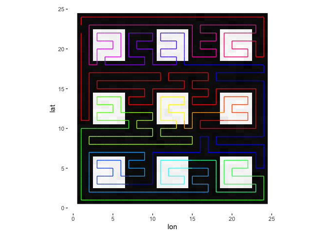
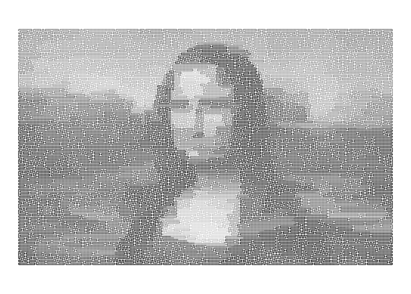

Context-Dependent Space Filling Curves
======================================

-   Why: 2D gridded data are harder to work with than 1D equally spaced
    data.
-   How: A space-filling curve algorithm inspired by the work of
    [Dafner, Cohen-Or and
    Matias (2000)](http://theory.stanford.edu/~matias/papers/eg2000.pdf).
-   What: Unlike Hilbert and Peano curves, which are universal (i.e.,
    context-independent), the algorithm proposed here adapts to the data
    provided as an input matrix. This matrix can be rectangular, and may
    even contain missing values (under certain constraints), as shown
    below. Results are both mesmerizing (IMO…) and potentially useful to
    model 2D gridded data as if it were 1D, while preserving some
    locality (spatial autocorrelation).

Examples
========

Setting up…

    library(scurvy)
    verbose = FALSE
    myplot <- function(square_data) {
      ggplot(data=cbind(expand.grid(lat=(3*r):1, lon=1:(3*r)), value=c(square_data)), 
             aes(x=lon,y=lat,fill=value)) + 
        geom_raster() + 
        scale_fill_gradient2(low = 'black', mid="red", high='white', midpoint = 0.5)
    }

Let’s start with a mock square dataset. For the algorithm to work, the
data matrix must have even numbers of rows and columns.

    r = 8
    set.seed(1)
    square = mapply(1:(3 * r), FUN = function(j) mapply(1:(3 * r), FUN = function(i) {
      f <- c(cos(2*(i)*pi/r), cos(2*(j)*pi/r), rnorm(1, sd = 0.01))
      (f[1] < 0) * (f[2] < 0) + f[3]
    }))
    myplot(square)

The algorithm draws a context-dependent path through the gridpoints so
that it spends as much time as possible in each “bubble” before moving
on to the next one.

    s = sfc(data = square, lat = nrow(square):1, lon = 1:ncol(square), verbose = verbose)
    plotPath(s, plot_data = TRUE, colored_line = 'val')

 Here’s another
way of depicting the path, now with color representing group ID.

    plotPath(s, plot_data = TRUE, colored_line = 'group_id')

 Let’s replace
one of the bubbles with NAs.

    squareNA = square
    squareNA[9:16, 13:20] = NA
    myplot(squareNA)

We can see the impact of NAs on the path.

    sNA = sfc(data = squareNA, lat = nrow(square):1, lon = 1:ncol(square), verbose = verbose)
    plotPath(sNA)

Not all datasets with NAs allow valid paths. It is better to pass a full
dataset without NAs into a function like `preprocess`, included in the
package. Here, for example, we fill with NAs most values above 0, except
those needed to make a valid path. Note that NAs come in 2x2 blocks that
end in even row and column numbers.

    squareB = preprocess(data = square, thresh = 0, verbose = verbose)
    myplot(squareB)

And shown below, the path adapts nicely to the NAs in the image.

    s = sfc(data = squareB, lat = nrow(square):1, lon = 1:ncol(square), verbose = verbose)
    plotPath(s, plot_data = TRUE)

OK, enough mock data. Let us look at a 2 degree gridded global
topography of the world.

    cETOPO4 = getCoarseETOPO(4)
    image(Matrix(cETOPO4$data))

We are only interested in bathymetry (depth &lt; 0 m), though, so we use
the function `preprocessBathymetry`.

    cETOPO4$data = preprocessBathymetry(cETOPO4$data, neritic = -1, verbose = verbose)
    s4 = sfc(data = cETOPO4$data, lat = cETOPO4$lat, lon = cETOPO4$lon, verbose = verbose)
    plotPath(s4)

Finally, we run the algorithm on the whole ETOPO30 bathymetry data.
Warning: this may take an hour to run, because it works with a large
(64k x 64k) sparse matrix.

    data = preprocessBathymetry(etopo30, neritic = -2000, verbose = verbose)
    lat = seq(89.75, -89.75, by=-0.5)
    lon = seq(-179.75, 179.75, by=0.5)
    sEtopo = sfc(data = data, lat = lat, lon = lon, verbose = verbose)
    plotPath(sEtopo)

Last example, with the Mona Lisa.

    ml = jpeg::readJPEG('./data/mona_lisa.jpg')
    gml = mapply(seq(1,762,by=3), FUN=function(j) mapply(seq(1,480,by=3), FUN=function(i) mean(ml[i,j,])))
    sml = sfc(data = gml, lat = nrow(gml):1, lon = 1:ncol(gml), verbose = TRUE)

    ## Building coarser gridded dataset... done.
    ## Building neighborood structure for dual graph... done.
    ## Building similarity matrix on dual graph... done.
    ## Building Minimum Spanning Tree for 10160 points... 1% 2% 3% 3.9% 4.9% 5.9% 6.9% 7.9% 8.9% 9.8% 10.8% 11.8% 12.8% 13.8% 14.8% 15.7% 16.7% 17.7% 18.7% 19.7% 20.7% 21.7% 22.6% 23.6% 24.6% 25.6% 26.6% 27.6% 28.5% 29.5% 30.5% 31.5% 32.5% 33.5% 34.4% 35.4% 36.4% 37.4% 38.4% 39.4% 40.4% 41.3% 42.3% 43.3% 44.3% 45.3% 46.3% 47.2% 48.2% 49.2% 50.2% 51.2% 52.2% 53.1% 54.1% 55.1% 56.1% 57.1% 58.1% 59.1% 60% 61% 62% 63% 64% 65% 65.9% 66.9% 67.9% 68.9% 69.9% 70.9% 71.9% 72.8% 73.8% 74.8% 75.8% 76.8% 77.8% 78.7% 79.7% 80.7% 81.7% 82.7% 83.7% 84.6% 85.6% 86.6% 87.6% 88.6% 89.6% 90.6% 91.5% 92.5% 93.5% 94.5% 95.5% 96.5% 97.4% 98.4% 99.4% done.
    ## Building connection matrix... done.
    ## Building path for dual tree... done.

    pml = plotPath(sml, colored_line = 'v', background = NA) + 
      theme_void() + 
      scale_color_gradientn(colours = gray(seq(0.1, 0.9, length.out = length(unique(sml$group$value)))))

    ## Scale for 'colour' is already present. Adding another scale for
    ## 'colour', which will replace the existing scale.

    pml

