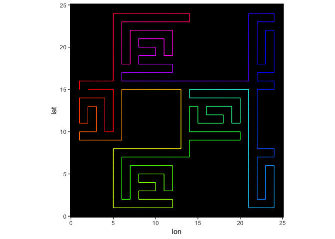

Setting up…

    library(surfacecurve)

    ## Loading required package: Matrix

    library(ggplot2)
    library(Matrix)
    verbose = FALSE

Let’s start with a mock square dataset.

    r = 8
    square = mapply(1:24, FUN = function(j) mapply(1:24, FUN = function(i) {
      sin((i-1)*pi/r) + cos((j-1)*pi/r) + 8 * sin((i-1)*pi/r) * cos((j-1)*pi/r)
    }))
    image(Matrix(square))

The algorithm draws a context-dependent path through the gridpoints so
that it spends as much time as possible in each “bubble” before moving
on to the next one.

    s = sfc(data = square, lat = nrow(square):1, lon = 1:ncol(square), verbose = verbose)

    ## Building Minimum Spanning Tree for 144 points... 69.4% done.

    plotPath(s)

Let’s remove one of the bubbles and replace it with NAs.

    squareNA = square
    squareNA[9:16, 13:20] = NA
    image(Matrix(squareNA))

We can see the impact of NAs on the path.

    sNA = sfc(data = squareNA, lat = nrow(square):1, lon = 1:ncol(square), verbose = verbose)

    ## Building Minimum Spanning Tree for 128 points... 78.1% done.

    plotPath(sNA)

Not all datasets with NAs allow valid paths. It is better to pass a full
dataset without NAs into a function like `preprocess`. Here, for
example, we fill with NAs most values above 0, except those needed to
make a valid path. Note that NAs come in 2x2 blocks that end in even row
and column numbers.

    squareB = preprocess(data = square, thresh = 0, verbose = verbose)
    image(Matrix(squareB))

    s = sfc(data = squareB, lat = nrow(square):1, lon = 1:ncol(square), verbose = verbose)

    ## Building Minimum Spanning Tree for 86 points... done.

    plotPath(s)

OK, enough mock data. Let us look at a 2 degree gridded global
topography of the world.

    cETOPO4 = getCoarseETOPO(4)
    image(Matrix(cETOPO4$data))

We are only interested in bathymetry (depth &lt; 0 m), though, so we use
`preprocessBathymetry`.

    cETOPO4$data = preprocessBathymetry(cETOPO4$data, neritic = -1, verbose = verbose)
    s4 = sfc(data = cETOPO4$data, lat = cETOPO4$lat, lon = cETOPO4$lon, verbose = verbose)

    ## Building Minimum Spanning Tree for 2932 points... 3.4% 6.8% 10.2% 13.6% 17.1% 20.5% 23.9% 27.3% 30.7% 34.1% 37.5% 40.9% 44.3% 47.7% 51.2% 54.6% 58% 61.4% 64.8% 68.2% 71.6% 75% 78.4% 81.9% 85.3% 88.7% 92.1% 95.5% 98.9% done.

    plotPath(s4)

 This may
take an hour: finally, we run the algorithm on the whole ETOPO30
bathymetry data.

    data = preprocessBathymetry(etopo30, neritic = -2000, verbose = verbose)
    lat = seq(89.75, -89.75, by=-0.5)
    lon = seq(-179.75, 179.75, by=0.5)
    sEtopo = sfc(data = data, lat = lat, lon = lon, verbose = verbose)

    ## Building Minimum Spanning Tree for 44031 points... 0.2% 0.5% 0.7% 0.9% 1.1% 1.4% 1.6% 1.8% 2% 2.3% 2.5% 2.7% 3% 3.2% 3.4% 3.6% 3.9% 4.1% 4.3% 4.5% 4.8% 5% 5.2% 5.5% 5.7% 5.9% 6.1% 6.4% 6.6% 6.8% 7% 7.3% 7.5% 7.7% 7.9% 8.2% 8.4% 8.6% 8.9% 9.1% 9.3% 9.5% 9.8% 10% 10.2% 10.4% 10.7% 10.9% 11.1% 11.4% 11.6% 11.8% 12% 12.3% 12.5% 12.7% 12.9% 13.2% 13.4% 13.6% 13.9% 14.1% 14.3% 14.5% 14.8% 15% 15.2% 15.4% 15.7% 15.9% 16.1% 16.4% 16.6% 16.8% 17% 17.3% 17.5% 17.7% 17.9% 18.2% 18.4% 18.6% 18.9% 19.1% 19.3% 19.5% 19.8% 20% 20.2% 20.4% 20.7% 20.9% 21.1% 21.3% 21.6% 21.8% 22% 22.3% 22.5% 22.7% 22.9% 23.2% 23.4% 23.6% 23.8% 24.1% 24.3% 24.5% 24.8% 25% 25.2% 25.4% 25.7% 25.9% 26.1% 26.3% 26.6% 26.8% 27% 27.3% 27.5% 27.7% 27.9% 28.2% 28.4% 28.6% 28.8% 29.1% 29.3% 29.5% 29.8% 30% 30.2% 30.4% 30.7% 30.9% 31.1% 31.3% 31.6% 31.8% 32% 32.3% 32.5% 32.7% 32.9% 33.2% 33.4% 33.6% 33.8% 34.1% 34.3% 34.5% 34.7% 35% 35.2% 35.4% 35.7% 35.9% 36.1% 36.3% 36.6% 36.8% 37% 37.2% 37.5% 37.7% 37.9% 38.2% 38.4% 38.6% 38.8% 39.1% 39.3% 39.5% 39.7% 40% 40.2% 40.4% 40.7% 40.9% 41.1% 41.3% 41.6% 41.8% 42% 42.2% 42.5% 42.7% 42.9% 43.2% 43.4% 43.6% 43.8% 44.1% 44.3% 44.5% 44.7% 45% 45.2% 45.4% 45.6% 45.9% 46.1% 46.3% 46.6% 46.8% 47% 47.2% 47.5% 47.7% 47.9% 48.1% 48.4% 48.6% 48.8% 49.1% 49.3% 49.5% 49.7% 50% 50.2% 50.4% 50.6% 50.9% 51.1% 51.3% 51.6% 51.8% 52% 52.2% 52.5% 52.7% 52.9% 53.1% 53.4% 53.6% 53.8% 54.1% 54.3% 54.5% 54.7% 55% 55.2% 55.4% 55.6% 55.9% 56.1% 56.3% 56.6% 56.8% 57% 57.2% 57.5% 57.7% 57.9% 58.1% 58.4% 58.6% 58.8% 59% 59.3% 59.5% 59.7% 60% 60.2% 60.4% 60.6% 60.9% 61.1% 61.3% 61.5% 61.8% 62% 62.2% 62.5% 62.7% 62.9% 63.1% 63.4% 63.6% 63.8% 64% 64.3% 64.5% 64.7% 65% 65.2% 65.4% 65.6% 65.9% 66.1% 66.3% 66.5% 66.8% 67% 67.2% 67.5% 67.7% 67.9% 68.1% 68.4% 68.6% 68.8% 69% 69.3% 69.5% 69.7% 70% 70.2% 70.4% 70.6% 70.9% 71.1% 71.3% 71.5% 71.8% 72% 72.2% 72.4% 72.7% 72.9% 73.1% 73.4% 73.6% 73.8% 74% 74.3% 74.5% 74.7% 74.9% 75.2% 75.4% 75.6% 75.9% 76.1% 76.3% 76.5% 76.8% 77% 77.2% 77.4% 77.7% 77.9% 78.1% 78.4% 78.6% 78.8% 79% 79.3% 79.5% 79.7% 79.9% 80.2% 80.4% 80.6% 80.9% 81.1% 81.3% 81.5% 81.8% 82% 82.2% 82.4% 82.7% 82.9% 83.1% 83.4% 83.6% 83.8% 84% 84.3% 84.5% 84.7% 84.9% 85.2% 85.4% 85.6% 85.8% 86.1% 86.3% 86.5% 86.8% 87% 87.2% 87.4% 87.7% 87.9% 88.1% 88.3% 88.6% 88.8% 89% 89.3% 89.5% 89.7% 89.9% 90.2% 90.4% 90.6% 90.8% 91.1% 91.3% 91.5% 91.8% 92% 92.2% 92.4% 92.7% 92.9% 93.1% 93.3% 93.6% 93.8% 94% 94.3% 94.5% 94.7% 94.9% 95.2% 95.4% 95.6% 95.8% 96.1% 96.3% 96.5% 96.8% 97% 97.2% 97.4% 97.7% 97.9% 98.1% 98.3% 98.6% 98.8% 99% 99.2% 99.5% 99.7% 99.9% done.

    plotPath(sEtopo)

